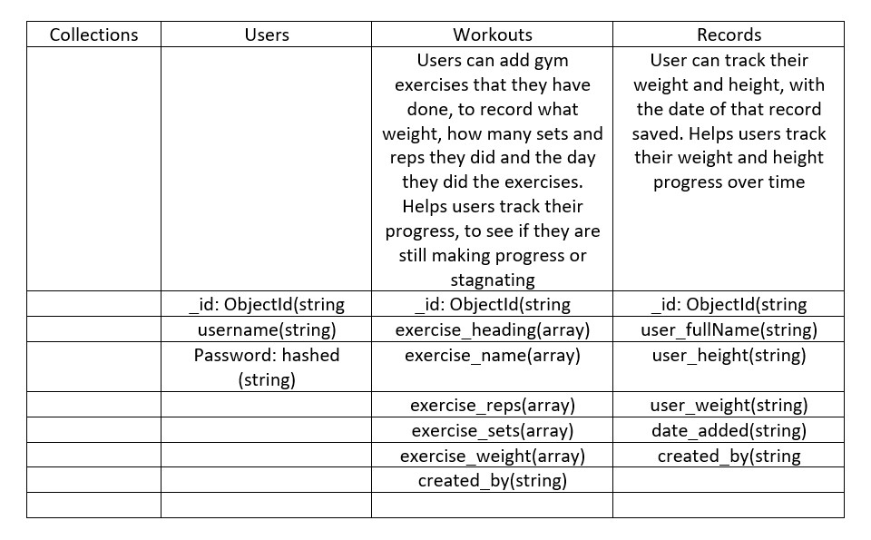

# **Gym Records**
# Strategy:
### Project Purpose
I was at the gym the other day and I saw someone pull out a booklet that had columns on. They were writing down the weights they had done for each different exercise. This made me think it would be perfect if I could do this but not have to worry about losing the booklet or forgetting it at home. I always have my phone on me.
### User Stories
1. 	As a user I want to be able to log into my own account, that is password protected.
1. 	As a new user I want to be able to create a new account with a username and a password.
1. 	As a user I want to have a feature that allows me to add my gym session, with all my workouts, repetitions, sets, and weights that I did during the session, this feature will also allow me to select the date of the gym session.
1.	As a user I want to add, edit, and delete any of the workouts I have created. 
1.	As a user I want to see all my workouts that I have done over the last week.
1.	As a user I want to be able to search by dates what workouts I did for that specific date, or date range.
1.	As a user I want to be able to see the latest week of workouts and the previous weeks workouts. With all other workouts being able to be found by searching by dates.
1.	As a user I want all my gym sessions and weeks to only be able to be seen by me, no other user can see my sessions. 

# Scope & Skeleton:
## Features
### Home Page:
Show a log in and sign-up button for the users at the top of the page. For the body of the home page, it will have an image mock-up showing examples of the website being used. These mock-ups will have some text next to them describing the purpose of the site. There will also be a large button for users to sign-up.

### Overview Page:

Search Option: On the left side of the page will be a search box for the user to input the name of a session heading or a week they want to search. Next to this search box will be a date selector. The user will choose a “from” and a “to” date. This date range will then show all the workouts the user added during this range.

Show the current weeks gym sessions at the top of the page, with the Session heading being collapsible. The user can click on the session heading and this will show all the gym sessions for that week. Next to the session heading will be the date that the user went to gym, this date is chosen when they are filling out the new session form. 

At the bottom of the gym session will be two buttons, one to delete the gym session and one to edit the session in case the user input something wrong into the session. Underneath the previous week’s gym sessions is a button that says, “View All”. Pressing this button will show the user all their previous gym sessions plus the current sessions.

### New Week Page:

The new week page will have a start date, which the user will choose for when they want that week to start. And an end date, which is for when the user wants the week to end. This week will be numbered after the previous week. If it is the first week then it will be “Week 1”, if it is the 10th week then it will be “Week 10”.

Below the date pickers and what the week number will be, there will be 2 buttons. One that says cancel, if the user wants to stop creating a new week. And another button for once the user has finished filling out the form that will say, “Create”. This button will then create the week. This newly created week will become the user’s new current week. Which will mean it shows at the top of the Overview page.

### New Session Page:

The user will land on a new page with a form for the new session. This form will have an input field for the user to give the session a heading. Below this input field will be another input field with the name of the workout for the user to put. “Workout: Bicep curls”. Next to this input field will be 3 dropdown options. These options will be Reps, sets and weight.

At the end of the row will be a plus sign. This sign adds a new line with the same input fields for the user to add a new workout. At the end of this row will be another plus sign for the user to add another workout. But first the first row this sign will now be a minus sign, this means the user can now remove this workout. The last workout will always have a plus sign next to it and a minus sign for the user to add new workouts or remove the last workout. But all the other rows will have a minus next to it. The first row will never have a minus sign next to it if another workout has not been added.

### Sign-In Page & Sign-Up Page:

Sign-in and sign-up pages will be remarkably similar except for some small differences. Both will ask the user for their username and password. However, the sign-up page will ask the user to confirm their password. This makes sure the user knows what password that they are typing in.Below the password field will be some small text telling the user the requirements for the password. This will say, “Must be a minimum of 5 characters”. Having this will help the user fill out the form quicker and feel less frustrated because they know what the requirements are.

At the bottom of the sign-in and sign-up forms will be two buttons. One button will be to cancel, this will take the user to the home page, and the other button will say “Sign In” and “Sign Up”.  Underneath these two buttons on the sign in form will be a link that say “New User? Sign Up”, this is for if the user happens to end up on the sign in page when they need the sign-up page. If the user clicks this link, it will take them to the sign-up form page. For the sign-up form page underneath the two buttons, will be a link that says, “Already signed up? Sign In”, clicking this link will take the user to the sign-in form page.

### Contact Us Page:

The contact us page will be a form; the user will put their username and email address. This way we can find their account on the database using their username and contact them using their email. Below the username and email inputs, will be a text area for the user to type whatever they wish to say to us. At the bottom of the form will be two buttons. On the left will be a button that says cancel, and when clicked the user will be taken back to the overview page. On the right will be a send button. Clicking this button will send the message through to us, and once clicked the user will be taken back to the overview page and a short message will show saying if the message was sent successfully or not.

### Footer:

The footer will have a link for users to ‘contact us’, social media links, and a sign-up button if a user has yet to sign-up, and a sign-out button if the user is already signed in.
Future Features

### Share Button:

Add in a share button for a day’s work out. This share button will send a link to someone else, which when clicked on will only show the day the user has shared and the user who got shared the link will not be able to edit or delete anything. They will only be shown the workouts, reps, sets and weights and the date of the workout.

### Plan Future Workouts:

Set workouts for the future and when that date comes around, the user will be able to see what weights, reps and sets they wanted to do for the workout, and they can put in underneath these what they achieved during the session. This gives the user the opportunity to see if they understand how well they are doing at gym or whether they need to push themselves more. 

# Structure:
### Data Schema

# Surface:

### Fonts & Colours
### Font – Raleway
Raleway is the 5th most used google font for fitness & gym websites. It is used by 3,583/55,085, meaning it is used by 6.504% of gym websites. This makes this means the font is not as generic as the other websites, helping it stand out a little better. 

[Most used fonts for gyms](https://www.ilovewp.com/resources/wordpress-for-gyms/most-used-google-fonts-on-gym-websites/)

### Colours
1. 0D47A1 - Blue darken-4
1. FFA726 – Orange lighten-1
1. 1E88E5 – Blue darken-1
1. E57373 – Red lighten-2
1. E0F2F1 - Teal lighten-5

### Images

When the user lands on the home page they will see two images when on desktop and one image when on their phone. The images will be mock-ups of what they are able to do, so they will see examples of what the website allows them to do. On desktop the first image will be accompanied by a heading that is asking the user a question. It may say, “Do you want to better track your workouts?”. Below this questioning heading will be a slightly bigger heading telling the user to open an account. Below this heading will be a button that says, “Sign Up” this button will take the user to the sign-up page. Below the image and the headings will be another mock-up image, showing a different feature from the website, with a short paragraph explaining the websites benefits and uses.
On mobile the one image will be a mock-up image followed by a short paragraph like the desktop version. Underneath the paragraph will be two buttons, one for the user to sign-in with and another for the user to sign-up with. 

# Wireframes

# Testing

# Deployment

# Credits
https://www.codegrepper.com/code-examples/css/javascript+confirm+delete for confirm delete of Workout