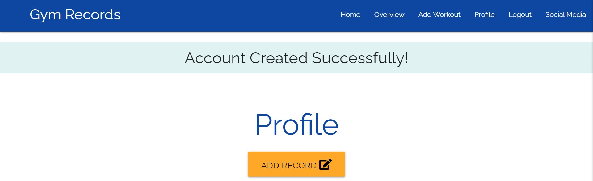

# **Gym Records** #

# Strategy:
### Project Purpose
I was at the gym the other day and I saw someone pull out a booklet that had columns on. They were writing down the weights they had done for each different exercise. This made me think it would be perfect if I could do this but not have to worry about losing the booklet or forgetting it at home. I always have my phone on me.
### User Stories
* 	As a user I want to be able to log into my own account, that is password protected.
* 	As a new user I want to be able to create a new account with a username and a password.
* 	As a user I want to have a feature that allows me to add my gym session, with all my workouts, repetitions, sets, and weights that I did during the session, this feature will also allow me to select the date of the gym session.
*	As a user I want to add, edit, and delete any of the workouts I have created. 
*	As a user I want to see all my workouts that I have done over the last week.
*	As a user I want to be able to search by dates what workouts I did for that specific date, or date range.
*	As a user I want to be able to see the latest week of workouts and the previous weeks workouts. With all other workouts being able to be found by searching by dates.
*	As a user I want all my gym sessions and weeks to only be able to be seen by me, no other user can see my sessions. 

---
# Scope & Skeleton:
## Features
### Home Page:
Show a log in and sign-up button for the users at the top of the page. For the body of the home page, it will have an image mock-up showing examples of the website being used. These mock-ups will have some text next to them describing the purpose of the site. There will also be a large button for users to sign-up.

### Overview Page:

* Search Option: On the left side of the page will be a search box for the user to input the name of a session heading or a week they want to search. Next to this search box will be a date selector. The user will choose a “from” and a “to” date. This date range will then show all the workouts the user added during this range.

* Collapsible: Show the most recent gym sessions at the top of the page, with the Session heading being collapsible. The user can click on the session heading and this will show all the gym exercises for that day. Next to the session heading will be the date that the user went to gym, this date is chosen when they are filling out the new session form. 

* Edit/Delete: On the right hand side of the gym session heading will be two buttons, one to delete the gym session and one to edit the session in case the user input something wrong into the session. 

### New Workout Page:

* Form: The user will land on a new page with a form for the new workout. This form will have an input field for the user to give the workout a heading. Below this input field will be another input field with the name of the workout for the user to put. “Workout: Bicep curls”. Next to this input field will be 3 dropdown options. These options will be Reps, sets and weight.

* Add/Delete Exercise: At the end of the row will be the option to add and delete exercise. The add exercise button adds a new line with the same input fields for the user to add a new workout. At the end of this row will be another add exercise button for the user to add another exercise, and a delete button for the user to delete that exercise. The user will not be able to delete the first exercise, there has to be a minimum of 1 exercise for the form to submit to the database.

### Login & Create Account:

* Login & Create Account Forms: Forms will be remarkably similar except for some small differences. Both will ask the user for their username and password. However, the create account form will ask the user to confirm their password. This makes sure the user knows what password that they are typing in. Below the password field will be some small text telling the user the requirements for the password. This will say, “Must be a minimum of 5 characters”. Having this will help the user fill out the form quicker and feel less frustrated because they know what the requirements are.

* Password: Passwords will be hashed by werkzeug, with a salt length of 128. The user will be able to see the password they are typing in my toggling the show password toggle at the end of the form. This option will be available on both forms.

* Logging In: At the bottom of the login and create account forms will be two buttons. One button will be to cancel, this will take the user to the home page, and the other button will say “Login” and “Create Account”.

---
## Future Features
### Share Button:

Add in a share button for a day’s work out. This share button will send a link to someone else, which when clicked on will only show the day the user has shared and the user who got shared the link will not be able to edit or delete anything. They will only be shown the workouts, reps, sets and weights and the date of the workout.

### Plan Future Workouts:

Set workouts for the future and when that date comes around, the user will be able to see what weights, reps and sets they wanted to do for the workout, and they can put in underneath these what they achieved during the session. This gives the user the opportunity to see if they understand how well they are doing at gym or whether they need to push themselves more. 

---
# Structure:
### Data Schema

---
# Surface:
### Fonts & Colours
### Font – Raleway
Raleway is the 5th most used google font for fitness & gym websites. It is used by 3,583/55,085, meaning it is used by 6.504% of gym websites. This makes this means the font is not as generic as the other websites, helping it stand out a little better. 

[Most used fonts for gyms](https://www.ilovewp.com/resources/wordpress-for-gyms/most-used-google-fonts-on-gym-websites/)

### Colours
1. 0D47A1 - Blue darken-4
1. FFA726 – Orange lighten-1
1. 1E88E5 – Blue darken-1
1. E57373 – Red lighten-2

---
### Images

* Desktop: Users that visit the site will see two images on the Home page. These are the only images to be found on the site. One image will be showing an image of a gym. The other will be a screenshot of one of the features of the site. This image can be updated if new features are added to the site. The image of the gym will take up the top left hand side of the home page. The screenshot of a site feature will be at the bottom right hand side of the site.

* Mobile: Users will be shown the same images as desktop users, but the positioning of the images will be different. The image of the gym will be shown in the centre of the screen. With a relevant heading and action button underneath. Undear the heading and button will be the screenshot of a site feature. Underneath the screenshot will be a paragraph of text.

---
# Wireframes

---
# Feature Testing
## User Account - Accout Login/Create Account:

 * As a user I land on the home page. I click on the Account link in the navbar. I am then taken to the Account Login/Creat Account page. 

    * I fill out the Username and Password and click Login. I get an error saying, "Incorrect Username/Password. This it to be expected because I have yet to create an account.

    * I click on the Create Account tab, and am taken to the Create Account Form. I fill in the form giving a usernane and Password, and confirm I have put in the correct password. Before clicking create account, I clicked the switch for the show password function. The password I had entered turned from being asterisks to text, I could then see both passwords I had entered were correct. I then click Create Account and I am logged into the site. I land on the Profile page.

    * I then click logout, which is in the navbar. I get a prompt to confirm I want to logout. I click "Ok". I then re-enter my login details into the login form, whilst filling in the form, I click show password. The asterisks then turn to text and I can see the password I have entered. And I Succesfully log into my account

# Records (CRUD)
## Add Record (Create): 
*  Once logged in, I saw a Add Record button. I clicked on it and it took me to a page that had a form with several different input fields for me to fill in.

    * I filled in the form with my relevant details and clicked Add Record.
    * After I clicked Add Record I was taken back to the profile page and the record I had just create was showing on the page

# Record Page (Read):
* All records that I add show on this page, they show all the information I added to the form and they give me options to edit and delete a record.

    * The date of the record was showing and once I clicked the dropdown button all the other information I had added to the form was showing
    * Logging out of my account and logging back in, the records were still saved

## Edit Record (Update):
* When clicking the edit button at the end of each record, I was redirected to a new page similar to the Add Record page, but the form had all the previous information I had added already in each field.

    * I decided I want to change the weight I had put down for one record
    * I changed the record, and clicked the Edit Record button
    * After clicking the button I was redirected back to the Profile page and i scrolled to find the record I had updated, I could see that the weight had now changed to the new value I had just updated it to.

## Delete Record (Delete):
* I wanted to now delete some records I had added, so I went to click the delete button.

    * Clicking the delete button, prompts a popup message. The message asks I am sure I want to delete the record. I click "OK" to delete it. 
    * The page reloads and I scroll down to see the record is deleted

# Workouts
## Add Workout (Created): 
* I clicked on the add Workout link in the navbar and the add workout button that shows on the overview page. Both take me to the same page. The page is a form that has input fields for me to fill out.

    * I give the workout session a name, an appropriate date, and I add 3 different workouts that I know. 
    
    * I click the delete exercise button and the last exercise that I added is deleted.

    * I then click add workout. I am taken to the overview page, and I can see the workout I had just added. I click the dropdown button and I can see all the exercises I had done with all the relevant information that I had added showing.

 

## Overview Page (Read): 
* All the workouts that I add are shown on this page.

## Edit Workout (Update): 
* I decided I wanted to edit the workout I had just created. I clicked on the edit button and was taken to a page that is identical to the add workout page, but this page had all my information already showing on the form.

    * I wanted to add in a few more exercises and change the heading to a more general heading. I change those fields on the form and clicked edit workout. I was taken back to the overview page and I could see the Workout heading had been change. I clicked on the dropdown and I could see my new exercises had been added.

## Delete Workout (Delete): 
* After a few days I decided I did not want to keep a record for the workout so I went to click delete workout.

    * I found the relevant workout I wanted to delete and clicked the delete button that is next to the edit button. When I clicked it, I got a pop-up alert asking if I was sure I wanted to delete the workout. I clicked "OK" to delete the workout. Once clicked the page reloaded and my workout was no longer showing on the overview page.

---
# Deployment

---
# Credits
https://www.codegrepper.com/code-examples/css/javascript+confirm+delete for confirm delete of Workout